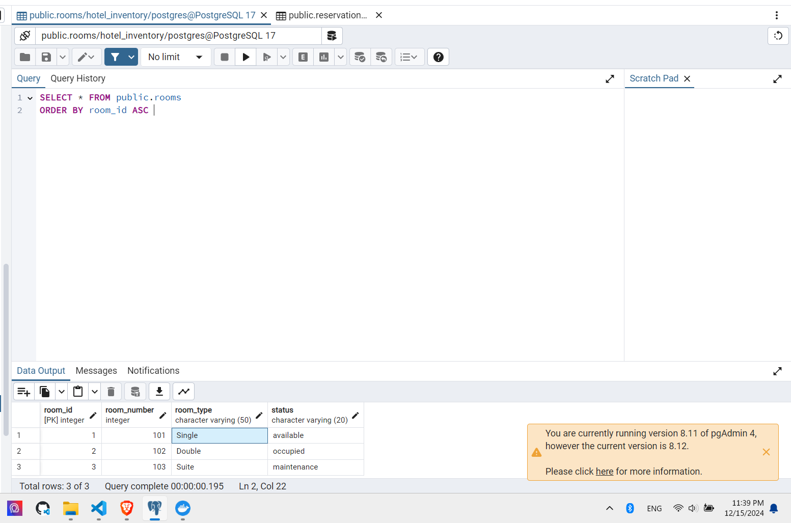

# Progreso 2 – Sistema de Gestión de Reservas para un Hotel

> Estudinate : Washington Yandun
> Fecha : 2024-12-15

## Introducción

Este documento describe la implementación de un sistema que permite gestionar reservas y disponibilidad de habitaciones de una cadena hotelera con sedes independientes, el cual es un problema planteado en el Progreso 2.

## Tecnologías Utilizadas

- **Python**: Lenguaje de programación principal.
- **FastAPI**: Para la implementación de la API REST y el microservicio.
- **Zeep**: Para implementar el servicio SOAP.
- **PostgreSQL**: Base de datos.
- **Docker** (Opcional): Para contenerizar los servicios.

Se decidió utilizar FastAPI por su facilidad de uso, rendimiento y documentación automática con OpenAPI. Zeep es una biblioteca SOAP para Python que permite crear y consumir servicios web de forma sencilla. PostgreSQL es una base de datos relacional que se utiliza para almacenar la información de las reservas y disponibilidad de habitaciones.

---

## Arquitectura General

El sistema está compuesto por tres servicios independientes:

1. **Servicio SOAP**: Permite consultar la disponibilidad de habitaciones.
2. **API REST**: Maneja reservas (crear, consultar, cancelar).
3. **Microservicio de Inventario**: Gestiona habitaciones (crear y actualizar estado).

Cada servicio tiene su propia base de datos y funciona como un proyecto independiente. Los servicios se sincronizan utilizando llamadas entre APIs y el servicio SOAP, asegurando que la información de disponibilidad y reservas esté siempre actualizada. Por ejemplo, la API REST consulta la disponibilidad mediante el servicio SOAP antes de registrar una nueva reserva, y el microservicio de inventario actualiza el estado de las habitaciones directamente en su base de datos correspondiente.

---

## Diseño del Sistema

### 1. Servicio Web SOAP (Consulta de Disponibilidad)

- **Funcionalidad**:
  - Consultar la disponibilidad de habitaciones por tipo, fechas y estado.
  - Responder en formato XML.

#### Base de Datos

- Tabla `availability`:
  - `room_id` (SERIAL, PK, AUTO\_INCREMENT)
  - `room_type` (VARCHAR)
  - `available_date` (DATE)
  - `status` (VARCHAR)

#### Endpoints SOAP

- Entrada:
  - `start_date`: Fecha de inicio.
  - `end_date`: Fecha de fin.
  - `room_type`: Tipo de habitación.
- Salida:
  - Lista de habitaciones disponibles en XML.

**Implementación del Servicio SOAP**:

```python
from fastapi import FastAPI
from fastapi.middleware.cors import CORSMiddleware
from zeep import CachingClient
import uvicorn
import xml.etree.ElementTree as ET
from datetime import datetime
import psycopg2

app = FastAPI()

app.add_middleware(
    CORSMiddleware,
    allow_origins=["*"],
    allow_credentials=True,
    allow_methods=["*"],
    allow_headers=["*"],
)

@app.post("/soap/availability")
def check_availability(start_date: str, end_date: str, room_type: str):
    connection = psycopg2.connect(database="hotel", user="user", password="password", host="localhost", port="5432")
    cursor = connection.cursor()
    query = """SELECT * FROM availability WHERE room_type=%s AND available_date BETWEEN %s AND %s"""
    cursor.execute(query, (room_type, start_date, end_date))
    rooms = cursor.fetchall()
    root = ET.Element("AvailabilityResponse")
    for room in rooms:
        room_elem = ET.SubElement(root, "room")
        ET.SubElement(room_elem, "room_id").text = str(room[0])
        ET.SubElement(room_elem, "room_type").text = room[1]
        ET.SubElement(room_elem, "available_date").text = str(room[2])
        ET.SubElement(room_elem, "status").text = room[3]
    connection.close()
    return ET.tostring(root, encoding='unicode')

if __name__ == "__main__":
    uvicorn.run(app, host="0.0.0.0", port=8001)
```

#### Implementación del Servicio SOAP - Documentación con WSDL


Al usar FastAPI, se puede generar automáticamente la documentación WSDL para el servicio SOAP. La documentación incluye información sobre los métodos disponibles, los parámetros de entrada y salida, y la estructura de los mensajes.

---

### 2. API REST (Gestión de Reservas)

- **Funcionalidad**:
  - Crear reservas (POST `/reservations`).
  - Consultar una reserva (GET `/reservations/{id}`).
  - Cancelar una reserva (DELETE `/reservations/{id}`).

#### Base de Datos

- Tabla `reservations`:
  - `reservation_id` (SERIAL, PK)
  - `room_number` (INT)
  - `customer_name` (VARCHAR)
  - `start_date` (DATE)
  - `end_date` (DATE)
  - `status` (VARCHAR)

#### Endpoints REST

**Implementación de la API REST**:

```python
from fastapi import FastAPI, HTTPException
import psycopg2
import uvicorn

app = FastAPI()

def get_db_connection():
    return psycopg2.connect(database="hotel", user="user", password="password", host="localhost", port="5432")

@app.post("/reservations")
def create_reservation(customer_name: str, room_number: int, start_date: str, end_date: str):
    connection = get_db_connection()
    cursor = connection.cursor()
    query = """INSERT INTO reservations (customer_name, room_number, start_date, end_date, status) VALUES (%s, %s, %s, %s, 'Confirmed') RETURNING reservation_id"""
    cursor.execute(query, (customer_name, room_number, start_date, end_date))
    reservation_id = cursor.fetchone()[0]
    connection.commit()
    connection.close()
    return {"reservation_id": reservation_id}

@app.get("/reservations/{id}")
def get_reservation(id: int):
    connection = get_db_connection()
    cursor = connection.cursor()
    cursor.execute("SELECT * FROM reservations WHERE reservation_id=%s", (id,))
    reservation = cursor.fetchone()
    connection.close()
    if not reservation:
        raise HTTPException(status_code=404, detail="Reservation not found")
    return {
        "reservation_id": reservation[0],
        "room_number": reservation[1],
        "customer_name": reservation[2],
        "start_date": reservation[3],
        "end_date": reservation[4],
        "status": reservation[5]
    }

@app.delete("/reservations/{id}")
def cancel_reservation(id: int):
    connection = get_db_connection()
    cursor = connection.cursor()
    cursor.execute("DELETE FROM reservations WHERE reservation_id=%s", (id,))
    connection.commit()
    connection.close()
    return {"message": "Reservation canceled"}

if __name__ == "__main__":
    uvicorn.run(app, host="0.0.0.0", port=8002)
```

#### Implementación de la API REST - Documentación con OpenAPI


---

### 3. Microservicio de Inventario

**Implementación del Microservicio**:

```python
from fastapi import FastAPI
import psycopg2
import uvicorn

app = FastAPI()

def get_db_connection():
    return psycopg2.connect(database="hotel", user="user", password="password", host="localhost", port="5432")

@app.post("/rooms")
def create_room(room_number: int, room_type: str, status: str):
    connection = get_db_connection()
    cursor = connection.cursor()
    cursor.execute("INSERT INTO rooms (room_number, room_type, status) VALUES (%s, %s, %s)", (room_number, room_type, status))
    connection.commit()
    connection.close()
    return {"message": "Room created"}

@app.patch("/rooms/{id}")
def update_room_status(id: int, status: str):
    connection = get_db_connection()
    cursor = connection.cursor()
    cursor.execute("UPDATE rooms SET status=%s WHERE room_id=%s", (status, id))
    connection.commit()
    connection.close()
    return {"message": "Room status updated"}

if __name__ == "__main__":
    uvicorn.run(app, host="0.0.0.0", port=8003)
```

#### Implementación del Microservicio de Inventario - Documentación con OpenAPI


## Conclusiones

El sistema implementado permite gestionar reservas y disponibilidad de habitaciones de una cadena hotelera de forma eficiente y escalable. La arquitectura basada en microservicios facilita la integración de nuevos servicios y la escalabilidad horizontal de cada componente. La documentación automática generada por FastAPI y la facilidad de implementación de servicios SOAP con Zeep permiten desarrollar sistemas complejos de forma rápida y eficiente.

## Evidencias de pruebas

#### Servicio SOAP - Consulta de Disponibilidad

Base de datos





Servicio SOAP


Servicio REST - Gestión de Reservas

Post


Get


Delete


Microservicio de Inventario

Post


Patch

